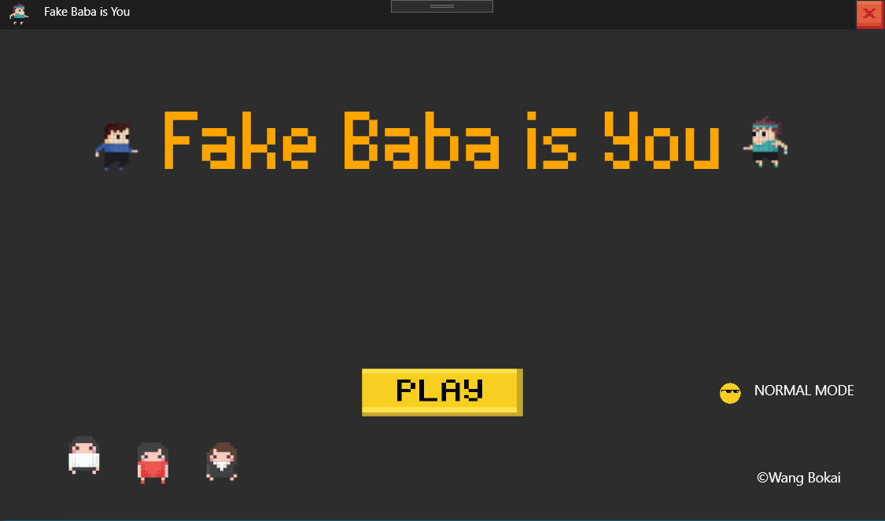
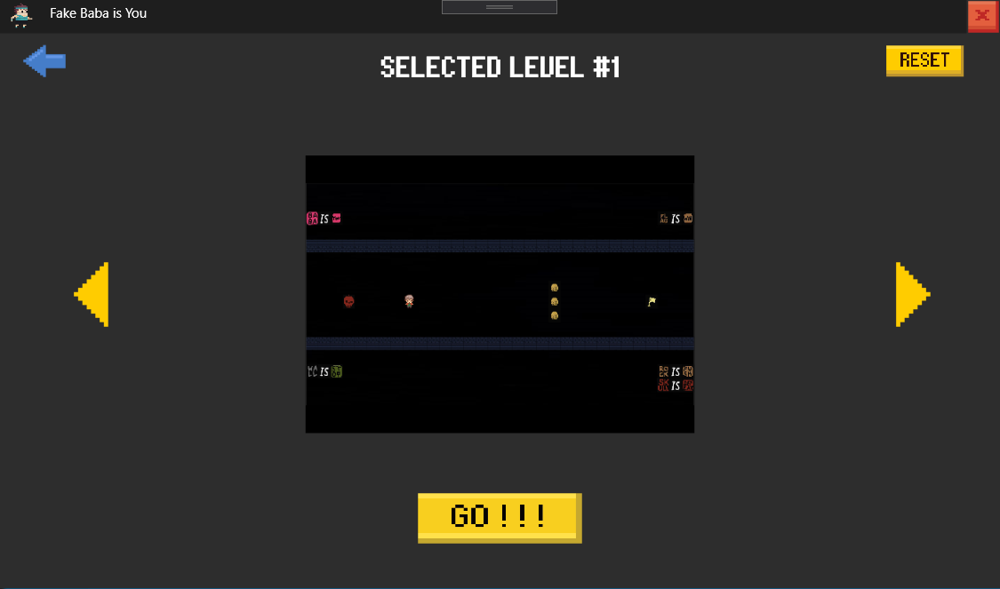
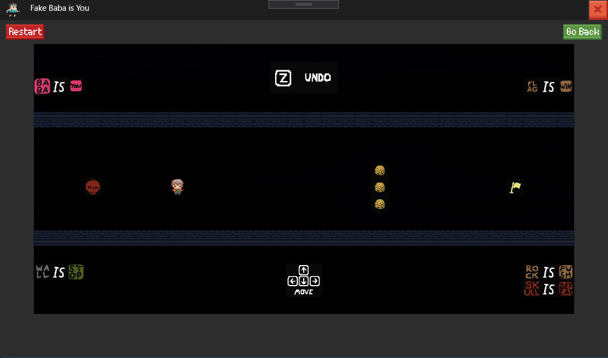
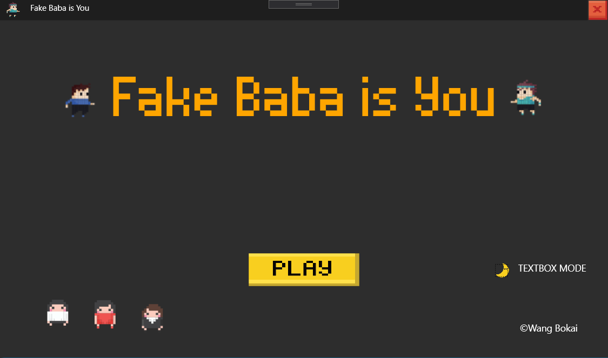
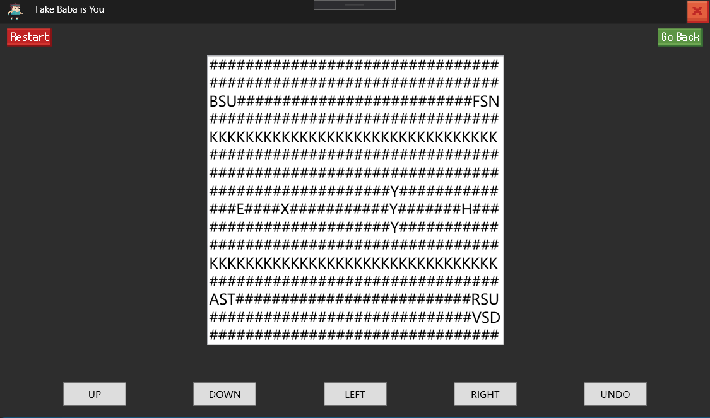

# Design Overview
###### *Remark: because of the size limitation of GitHub. Please check this game through [Google Drive Link](https://drive.google.com/file/d/13WRB6cAD2tWMnKBLcsy7sPmhq7ysley_/view?usp=sharing).
## Page Design
In this game, we totally have one MainWindow and 11 other pages.
- **HomePage** is served as the start screen
- **LevelChoosePage1** and **LevelChoosePage2** are used for user to choose different game levels and have a basic understood of the map and difficulty of the game
- **GameLevel1Page** and **GameLevel2Page** contain the main game map
- **FailPage** and **FailPage2** are designed to demonstrate two different outcomes if the player fails the game
- **CongratulationLevel1Page** and **CongratulationLevel2Page** will popup once the user finish Level1 or Level2
- **EndPage** is to tell the player that all levels have been finished
## Class Design
- **MainWindow.xaml.cs**
    1. Set WindowStartupLocationload to the center of the screen.
    2.	Load the background music and loop it on and on.
    3.	Use NavigationService.Navigate directing to the *HomePage*.
    4.	Set the MouseDown event for user to drag the game window.
    5.	Load the icon of the game
- **HomePage.xaml.cs**
    1.	jumpAnimation is designed to enable the slow jumping animation of three Cartoon characters at the start screen. 
    2.	EnableTextBoxMode and DisableTextBoxMode are used to meet the two mode (Normal GUI mode and TextBox mode) transform requirement.
    3.	StartGame is used to directing the page to *LevelChoosePage1* or *TextBoxGame1Page* depending on the TextBoxModeEnabled is enabled or not.
    4.	CloseWindow is implemented for user to quit the game.
- **LevelChoosePage1.xaml.cs**
    1.	BackHome is designed to direct the page back to *HomePage*.
    2.	NextLevel is designed to direct the page to *LevelChoosePage2*.
    3.	PlayLevel is used to direct the page to *GameLevel1Page*.
    4.	CloseWindow is implemented for user to quit the game.
- **LevelChoosePage2.xaml.cs**
    1.	BackHome and CloseWindow are same as *LevelChoosePage1*. (Class Reuse)
    2.	PlayLevel is used to direct the page to *GameLevel2Page*.
    3.	ResetGame and PreviousLevel is used to direct the page to *LevelChoosePage1* since we only have two levels.
- **GameLevel1Page.xaml.cs**
    1.	my_positon and positiondata are used to store the position change of movable elements.
    2.	CheckWin is used to detect the victory status of the game. If win, it will direct to next game level.
    3.	Button_Click is the back button used to direct to *LevelChoosePage1*.
    4.	Genius_KeyDown is used to capture the input of the keyboard and perform the corresponding functions.
    5.	CheckBox is designed to find all the movable items (item before phrase "is push" and all the words) and perform corresponding functions.
    6.	CheckAim is used to check whether the hero item (item before phrase "is you") is collision with the target item (item before phrase "is win"). 
    7.	CheckKill is used to check whether the hero item (item before phrase "is you") is collision with the harmful item (item before phrase "is defeat"). 
    8.	AimCollision is implemented using IntersectsWith to check whether hero item and win/kill item are at same position (or called collision like before) on canvas.
    9.	BoxCheckBox is used to find whether there is another movable item before a movable item and change the position of them once they have been "pushed" by hero element.
    10.	CheckStone is used to check whether the hero item (item before phrase "is you") is collision with the unmovable item (item before phrase "is stop"). 
    11.	StoneCollision is implemented using IntersectsWith to check whether hero item and unmovable item are at same position (or called collision like before) on canvas.
    12.	BoxCollision is implemented using IntersectsWith to check whether two movable items are at same position (or called collision like before) on canvas.
    13.	CheckBound is designed to check if the hero item is out of the boundary.
    14.	NPCMove is used to reset the position on canvas for all movable elements and use BeginAnimation and corresponding duration to implement the moving animation.
    15.	Genius_LostKeyboardFocus is to guarantee the focus will not lose during the animation
    16.	Genius_KeyUp is used to check status (kill/win) once keyup.
    17.	Save is implemented to save the movable items' position after every step.
    18.	Back is used implement undo once "z" is pressed.
    19.	Button_Click_1 is designed to reset the game.
    20.	Button_Click_2 is same as CloseWindow in *LevelChoosePage1*. (Class Reuse)
- **GameLevel2Page.xaml.cs**
    1.	my_positon, positiondata, CheckWin, Genius_KeyDown, CheckBox, CheckAim, AimCollision, BoxCheckBox, CheckStone, StoneCollision, BoxCollision, CheckBound, NPCMove, Game_LostKeyboardFocus (Genius_LostKeyboardFocus), Game_KeyUp (Genius_KeyUp), save, back, Button_Click_1 and Button_Click_2 are same as *GameLevel1Page*. (Class Reuse)
    2.	Button_Click is the back button used to direct to *“*LevelChoosePage2*.
    3.	CheckStop is used to determine which item can't push (item before phrase "is stop").
    4.	CheckHero is used to determine which item can't push (item before phrase "is you").
    5.	CheckFlag is used to determine which item can't push (item before phrase "is win").
- **FailPage.xaml.cs**
    1.	ContinueOrRestart is used to direct the page to *LevelChoosePage1*.
    2.	CloseWindow is same as *LevelChoosePage1*. (Class Reuse)
- **FailPage2.xaml.cs**
    1. ContinueOrRestart and CloseWindow are same as *FailPage*. (Class Reuse)
- **CongratulationLevel1Page.xaml.cs**
    1.	ContinueOrRestart is used to direct the page to *GameLevel2Page*.
    2.	CloseWindow is same as *LevelChoosePage1*. (Class Reuse)
- **CongratulationLevel2Page.xaml.cs**
    1.	ContinueOrRestart is used to direct the page to *EndPage*.
    2.	CloseWindow is same as *LevelChoosePage1*. (Class Reuse)
- **EndPage.xaml.cs**
    1.	Button_Click_1 and BackHome is same as *LevelChoosePage1*. (Class Reuse)
- **TextBoxGamePage.xaml.cs**
    1.	my_positon, positiondata, CheckWin, Genius_KeyDown, CheckBox, CheckAim, AimCollision, BoxCheckBox, CheckStone, StoneCollision, BoxCollision, CheckBound, NPCMove, Game_LostKeyboardFocus (Genius_LostKeyboardFocus), Game_KeyUp (Genius_KeyUp), save, back, Button_Click_1 and Button_Click_2 are same as *GameLevel1Page*. (Class Reuse)
## Software Pattern
### Model-View Separation
In our project, we use Model-View Separation patten to decouple Model and View in order to make code clean and make it possible for us to use same logic in GUI mode as well as TextBox mode.
### Model-View-Controller
In our project, we use Model-View-Controller patten to use different event handlers in WPF to handle the user input.
### Strategy
In our project, we use Strategy patten to maintain the same running logic for any assigned focused hero element.
### Game Overview
#### Mode 1: WPF GUI

#### Mode 2: TextBox (underlying logic)

